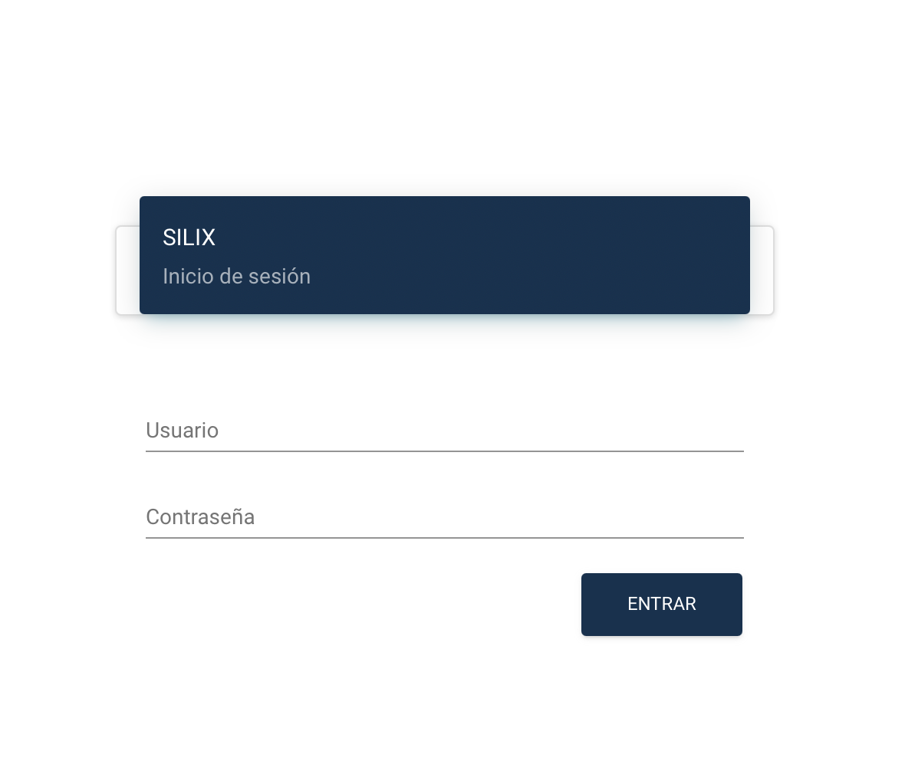
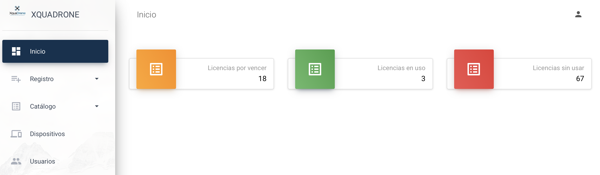

# Sistema de licencias Xquadrone (SILIX)

## Contenido
- [Inicio de sesión](#inicio-de-sesión)
- [Dasboard](#dasboard)

# Inicio de sesión
Acceso para administración o visualización del sistema web, donde el usuario utiliza un nombre de usuario y una contraseña. El sistema le presentará la información al usuario de acuerdo al rol que tiene.

# Dasboard
Permite visualizar licencias por vencer, licencias en uso y licencias disponibles. Como usuario administrador permite visualizar las licencias de todas las empresas y aliados, si es un usuario diferente de administrador
solo se le mostrara las que le corresponden a su empresa o solucion.

